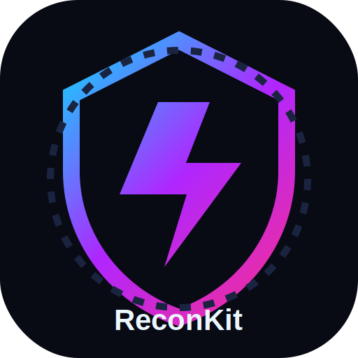
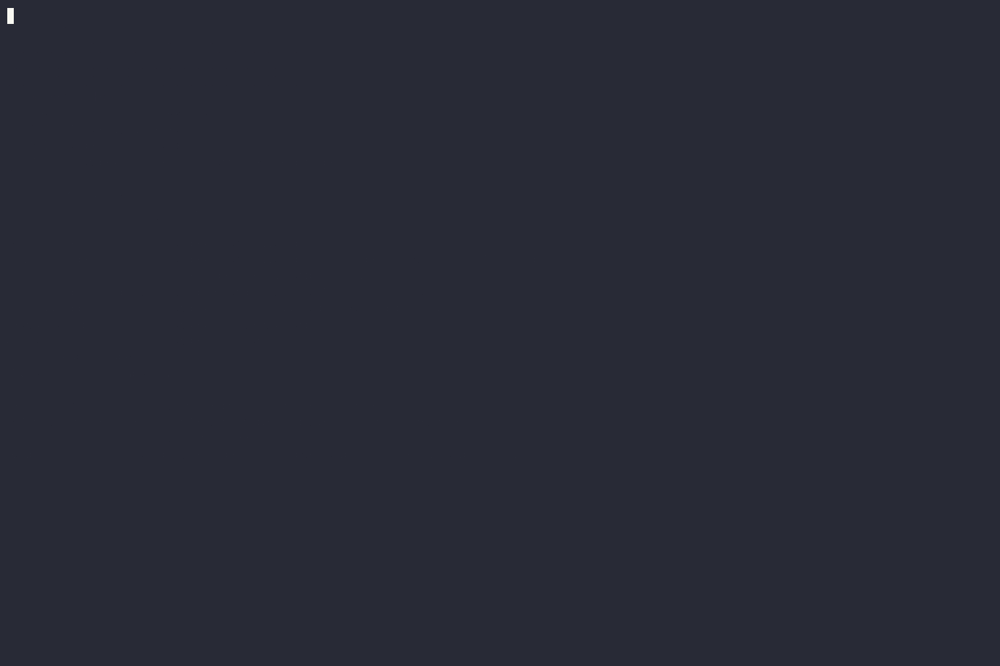

<p align="center">
  
</p>

<h1 align="center">ReconKit ⚡</h1>

<p align="center">
  <b>Beautiful, beginner-friendly, AI-ready reconnaissance console for authorized red-team and defensive exposure reviews.</b>
</p>

<p align="center">
  <a href="https://cynetx.ir"><b>Team CynetX</b></a> •
  <a href="https://t.me/cynetx">Telegram</a> •
  <code>nmap</code> • <code>dig</code> • <code>whatweb</code> • <code>httpx</code> • <code>nuclei</code> • <code>OpenRouter AI</code>
</p>

<p align="center">
  
  
  
</p>

---

## ✨ What Is ReconKit?

ReconKit is a polished terminal reconnaissance assistant that wraps trusted security tools, cleans their output, and turns noisy scan results into readable operator dashboards and reports.

It is designed for:

- Red-team operators doing authorized external recon.
- Blue-team/security engineers reviewing public exposure.
- Beginners who want a guided console instead of memorizing every command.
- Report writers who need JSON, Markdown, HTML, raw artifacts, and optional AI analysis.

> **Safety note:** ReconKit is for systems you own or have explicit permission to test. It does not run brute force, exploit payloads, malware, persistence, evasion, or destructive actions.

---

## 🚀 Highlights

- 🕹️ **Metasploit-style console**: run `reconkit`, then use `set`, `show`, `run`, `mission`, `install`, `test ai`.
- 🛰️ **Smart recon workflow**: DNS, nmap, WHOIS, web fingerprinting, TLS checks, passive discovery, screenshots, nuclei templates.
- 🧠 **AI analyst mode**: send normalized scan evidence to OpenRouter and receive an English defensive analysis.
- 📊 **Beautiful reports**: console dashboard, JSON, Markdown, HTML, diff reports, and raw evidence folders.
- 🧩 **Dependency installer**: best-effort install using `apt`, `dnf`, `pacman`, `apk`, `brew`, `winget`, `choco`, `go install`, and Python/pip fallbacks.
- 🪟 **Windows-friendly**: creates `reconkit.cmd`/`reconkit.ps1`, persists user PATH, and skips unsupported optional tools cleanly.
- 🧼 **Readable output**: aligned tables, wrapped columns, concise findings, quick-take risk hints.

---

## 📸 Demo Showcase

> Put your GIFs in `assets/demos/` and GitHub will render them automatically.

### ⚡ Interactive Console

<p align="center">
  
</p>

```bash
reconkit
```

### 🛰️ Mission Scan

<p align="center">
  
</p>

```bash
reconkit scanme.nmap.org --mission --no-whois --raw-dir artifacts -o scan.json --markdown report.md --html report.html -t 120
```

### 🧠 AI Analysis

<p align="center">
  
</p>

```bash
reconkit scanme.nmap.org -M safe --no-whois --ai --ai-out ai-report.md -o ai-scan.json -t 90
```

### 📊 HTML Report

<p align="center">
  
</p>

```bash
reconkit scanme.nmap.org -M safe --no-whois -o scan.json --markdown report.md --html report.html
python3 -m http.server 8080
```

Open `http://127.0.0.1:8080/report.html`.

---

## ⚡ Quick Start

### 1) Install the `reconkit` command only

```bash
python3 recon.py --self-install --user
```

### 2) Open the interactive console

```bash
reconkit
```

Inside the console:

```text
reconkit(no-target)> help
reconkit(no-target)> set target example.com
reconkit(example.com)> set mode balanced
reconkit(example.com)> set modules mission
reconkit(example.com)> enable no_whois
reconkit(example.com)> run
reconkit(example.com)> exit
```

### 3) Or run one-shot scans

```bash
reconkit example.com
reconkit example.com --deep --ai --ai-out ai-report.md -o scan.json -t 120
reconkit example.com --mission --raw-dir artifacts -o scan.json --markdown report.md --html report.html
```

---

## 🧭 Interactive Console Guide

Run `reconkit` with no arguments to enter the guided console.

| Command | What it does |
|---|---|
| `help` or `?` | Shows console commands. |
| `show options` | Shows current target, profile, modules, report paths, and flags. |
| `show modules` | Shows module presets. |
| `show deps` | Prints dependency status. |
| `set target example.com` | Sets the target domain, IP, or URL. |
| `set mode fast` | Sets scan mode: `fast`, `balanced`, or `deep`. |
| `set modules mission` | Sets module preset or comma-separated modules. |
| `set ports 80,443,8080` | Uses custom ports. |
| `unset ports` | Clears custom ports and returns to defaults. |
| `set timeout 120` | Sets per-tool timeout in seconds. |
| `set raw_dir artifacts` | Sets raw artifact output directory. |
| `set json scan.json` | Sets JSON output path. |
| `set markdown report.md` | Sets Markdown output path. |
| `set html report.html` | Sets HTML output path. |
| `enable ai` / `disable ai` | Enables/disables AI analysis. |
| `enable aggressive` | Enables heavier safe checks when tools exist. |
| `enable no_whois` | Skips WHOIS. |
| `enable show_commands` | Shows exact tool commands in output. |
| `run` or `scan` | Runs the scan using current options. |
| `quick example.com` | Runs a fast safe scan immediately. |
| `mission example.com` | Runs the full mission workflow. |
| `install` | Installs required + optional tools best-effort. |
| `dryrun` | Shows dependency install plan without installing. |
| `test ai` | Tests OpenRouter endpoint/model/API key. |
| `shell <command>` | Runs a local shell command. |
| `clear` | Clears the screen and redraws the console banner. |
| `exit`, `quit`, `q` | Leaves the console. |

---

## 🛠️ Installation

### Linux / Kali / Ubuntu / Debian

```bash
sudo apt update
sudo apt install -y python3 python3-pip git
python3 recon.py --self-install --user
reconkit --install-deps --with-optional
reconkit --check-deps
```

### Fedora / RHEL-like

```bash
sudo dnf install -y python3 git
python3 recon.py --self-install --user
reconkit --install-deps --with-optional
```

### Arch Linux

```bash
sudo pacman -Sy --needed python git
python3 recon.py --self-install --user
reconkit --install-deps --with-optional
```

### Alpine Linux

```bash
sudo apk add python3 git
python3 recon.py --self-install --user
reconkit --install-deps --with-optional
```

### macOS

```bash
brew install python git
python3 recon.py --self-install --user
reconkit --install-deps --with-optional
```

### Windows PowerShell

Open PowerShell in the project directory:

```powershell
Set-ExecutionPolicy -Scope CurrentUser RemoteSigned
.\scripts\install-windows.ps1
```

Then open a new PowerShell window:

```powershell
reconkit
reconkit --check-deps
reconkit scanme.nmap.org -M safe --no-whois -t 90
```

### Windows CMD

```cmd
scripts\install-windows.cmd
```

### Manual Windows setup

```powershell
py -3 recon.py --self-install --user
$env:Path += ";$env:USERPROFILE\.reconkit\bin"
reconkit --install-deps --with-optional
reconkit --check-deps
```

> On Windows, `dig` and `host` are treated as optional because they are Unix/BIND-style tools. ReconKit uses a Python DNS fallback for basic A/AAAA resolution if they are missing.

---

## 📦 Dependency Installer

ReconKit detects available installers and builds a best-effort install plan.

| Platform | Providers |
|---|---|
| Debian/Ubuntu/Kali | `apt` |
| Fedora/RHEL-like | `dnf` |
| Arch | `pacman` |
| Alpine | `apk` |
| macOS | `brew` |
| Windows | `winget`, `choco` |
| Cross-platform fallback | `go install`, `pipx`, `python -m pip --user` |

Preview install commands:

```bash
reconkit --install-deps --with-optional --dry-run
```

Install required tools only:

```bash
reconkit --install-deps
```

Install required + optional tools:

```bash
reconkit --install-deps --with-optional
```

Check status:

```bash
reconkit --check-deps
```

### Tools ReconKit Can Use

| Category | Tools |
|---|---|
| Core | `nmap`, `dig`, `host`, `nslookup`, `whois` |
| Web fingerprinting | `whatweb`, `httpx` / `httpx-toolkit`, `curl` |
| WAF/TLS | `wafw00f`, `sslscan`, `testssl.sh` |
| Passive discovery | `subfinder`, `amass` |
| HTTP crawling/screenshots | `katana`, `gowitness` |
| Template checks | `nuclei` |
| Reporting helper | `jq` |

Missing optional tools are shown clearly and skipped cleanly.

---

## 🔍 Scan Modes

| Mode | Command | Use when |
|---|---|---|
| `fast` | `reconkit example.com` | You want quick DNS + common-port nmap results. |
| `balanced` | `reconkit example.com -m balanced` | You want broader common service coverage. |
| `deep` | `reconkit example.com -m deep` or `--deep` | You want nmap service/version/default-script detection with fallback discovery. |

---

## 🧩 Modules

Use `-M` / `--modules` to choose extra modules.

| Module | What it runs |
|---|---|
| `none` | Core DNS + nmap only. |
| `dns` / `dns-tools` | `host`, `nslookup` summaries. |
| `dns-deep` | Safe DNS AXFR validation with `dig axfr`. |
| `passive` / `subdomains` | Passive discovery with `subfinder` and `amass` when installed. |
| `web` | Web fingerprinting with `whatweb`, `httpx`, and WAF check with `wafw00f`. |
| `http` | `web` + HTTP header checks and shallow crawl. |
| `http-detail` | `curl` headers and `katana` shallow crawl when installed. |
| `tls` / `ssl` | TLS checks with `sslscan` or `testssl.sh`. |
| `screenshots` / `shots` | Web screenshot with `gowitness`. |
| `templates` / `nuclei` | Safe nuclei template checks when installed. |
| `safe` | `dns-tools`, `web`, `tls`. Default. |
| `all` | `safe`, `passive`, `dns-deep`, `http-detail`. |
| `full` | `all`, `screenshots`, `templates`. |
| `mission` | Same as `full`; designed for full workflow scans. |

Examples:

```bash
reconkit example.com -M none
reconkit example.com -M web,tls,http-detail
reconkit example.com -M passive,dns-deep
reconkit example.com --mission
```

---

## 🧾 All CLI Switches

| Switch | Example | Explanation |
|---|---|---|
| `target` | `reconkit example.com` | Domain, IP, or URL to scan. |
| `-h`, `--help` | `reconkit --help` | Show help and examples. |
| `-m`, `--mode`, `--profile` | `-m balanced` | Scan mode: `fast`, `balanced`, `deep`. |
| `-p`, `--ports` | `-p 80,443,8080` | Custom nmap ports/ranges. |
| `-M`, `--modules` | `-M web,tls` | Extra modules or presets. |
| `-A`, `--aggressive` | `-A` | Enables heavier safe checks when tools exist, such as `nikto`/`testssl.sh`. |
| `-t`, `--timeout` | `-t 120` | Per-tool command timeout in seconds. |
| `-o`, `--json` | `-o scan.json` | Save normalized JSON report. |
| `--markdown`, `--md` | `--markdown report.md` | Save Markdown report. |
| `--html` | `--html report.html` | Save standalone HTML report. |
| `--raw-dir` | `--raw-dir artifacts` | Save raw tool outputs/artifacts. |
| `--diff` | `--diff old.json` | Compare current scan with previous JSON. |
| `--deep` | `--deep` | Alias for `-m deep`. |
| `--mission` | `--mission` | Enables the full mission module set. |
| `--passive` | `--passive` | Adds passive subdomain discovery modules. |
| `--http-detail` | `--http-detail` | Adds HTTP headers and shallow crawl. |
| `--screenshots` | `--screenshots` | Captures screenshot with `gowitness` when installed. |
| `--templates`, `--nuclei` | `--templates` | Runs nuclei templates when installed and authorized. |
| `--cmd`, `--show-commands` | `--cmd` | Shows exact commands ReconKit executed. |
| `--explain` | `--explain` | Shows a switch guide in the scan output. |
| `--no-color` | `--no-color` | Disables ANSI colors. Useful for CI/log files. |
| `--no-whois` | `--no-whois` | Skips WHOIS lookup. |
| `--install-deps` | `--install-deps` | Installs required tools best-effort. |
| `--self-install`, `--setup` | `--self-install --user` | Installs the `reconkit` command. |
| `--user` | `--self-install --user` | Prefer user bin directory such as `~/.local/bin` or `%USERPROFILE%\.reconkit\bin`. |
| `--with-optional` | `--install-deps --with-optional` | Also install optional recon/web/TLS tools. |
| `--dry-run` | `--install-deps --dry-run` | Print install plan without installing. |
| `--check-deps` | `--check-deps` | Print dependency status and exit. |
| `--ai` | `--ai` | Analyze scan results using `recon_config.json`. |
| `--ai-timeout` | `--ai-timeout 90` | AI request timeout in seconds. |
| `--ai-out` | `--ai-out ai-report.md` | Save AI analysis to a file. |
| `--ai-prompt` | `--ai-prompt` | Print configured AI system prompt and exit. |
| `--show-config` | `--show-config` | Print loaded AI config without exposing the full API key. |
| `--test-ai` | `--test-ai` | Test AI endpoint/model/API key without scanning. |

---

## 🧠 AI Analysis With OpenRouter

ReconKit reads AI settings from `recon_config.json`.

Example config:

```json
{
  "provider": "openrouter",
  "endpoint_url": "https://openrouter.ai/api/v1/chat/completions",
  "model": "openrouter/free",
  "api_key_env": "OPENROUTER_API_KEY",
  "api_key": "",
  "temperature": 0.15,
  "max_tokens": 5000,
  "continuation_rounds": 5,
  "empty_response_retries": 5,
  "retry_delay_seconds": 3,
  "http_referer": "https://local.reconkit",
  "x_title": "ReconKit AI Analysis"
}
```

Recommended API key usage:

```bash
export OPENROUTER_API_KEY="sk-or-..."
reconkit --test-ai
reconkit example.com --deep --ai --ai-out ai-report.md -o scan.json
```

AI output structure:

1. Executive Summary
2. Attack Surface Table
3. Risk Assessment
4. How an Attacker Might Abuse This (Defensive View)
5. Recommended Next Authorized Tests
6. Defensive Hardening Plan
7. Top 5 Priorities
8. Data Quality Notes

> The AI prompt is defensive by design: no exploit payloads, no brute-force instructions, no malware, no persistence, no evasion.

---

## 📊 Reports And Artifacts

| Output | Command | Result |
|---|---|---|
| Console | `reconkit example.com` | Pretty terminal dashboard. |
| JSON | `-o scan.json` | Machine-readable normalized data. |
| Markdown | `--markdown report.md` | GitHub/client-friendly report. |
| HTML | `--html report.html` | Standalone HTML report. |
| Raw evidence | `--raw-dir artifacts` | Tool outputs and artifacts. |
| Diff | `--diff old.json` | Highlights changes from a previous scan. |
| AI report | `--ai-out ai-report.md` | Saved AI analysis. |

Example full report workflow:

```bash
reconkit example.com --mission --raw-dir artifacts -o scan.json --markdown report.md --html report.html --ai --ai-out ai-report.md -t 120
```

---

## 🎬 Recording GIFs For GitHub

Install recorder:

```bash
sudo apt update
sudo apt install -y asciinema
```

Record demos:

```bash
asciinema rec assets/demos/home-dashboard.cast -c "reconkit"
asciinema rec assets/demos/mission-scan.cast -c "reconkit scanme.nmap.org --mission --no-whois --raw-dir artifacts -o scan.json --markdown report.md --html report.html -t 120"
asciinema rec assets/demos/ai-analysis.cast -c "reconkit scanme.nmap.org -M safe --no-whois --ai --ai-out ai-report.md -o ai-scan.json -t 90"
asciinema rec assets/demos/html-report.cast -c "reconkit scanme.nmap.org -M safe --no-whois -o scan.json --markdown report.md --html report.html"
asciinema rec assets/demos/install-deps.cast -c "reconkit --install-deps --with-optional --dry-run"
asciinema rec assets/demos/diff-scan.cast -c "reconkit scanme.nmap.org -M none --no-whois --diff old.json -o new.json"
```

Convert casts to GIFs if `agg` is installed:

```bash
agg assets/demos/home-dashboard.cast assets/demos/home-dashboard.gif
agg assets/demos/mission-scan.cast assets/demos/mission-scan.gif
agg assets/demos/ai-analysis.cast assets/demos/ai-analysis.gif
agg assets/demos/html-report.cast assets/demos/html-report.gif
agg assets/demos/install-deps.cast assets/demos/install-deps.gif
agg assets/demos/diff-scan.cast assets/demos/diff-scan.gif
```

Tips:

- Use a wide terminal: `120x34` or larger.
- Keep colors enabled for a more cinematic GIF.
- Use `scanme.nmap.org` for public demos because it is intentionally provided for nmap testing.
- Clean old outputs before recording: `rm -rf artifacts scan.json report.md report.html ai-report.md old.json new.json`.

---

## 🧯 Troubleshooting

| Problem | Fix |
|---|---|
| `reconkit: command not found` | Run `python3 recon.py --self-install --user`, then open a new terminal. |
| `Permission denied` from old launcher | Remove the broken old launcher earlier in `PATH`, then self-install again. |
| `httpx` missing on Ubuntu | Run `reconkit --install-deps --with-optional`; ReconKit uses `go install` fallback. |
| `amass` unavailable in `apt` | This is normal on many distros; ReconKit uses fallback/manual notes. |
| Windows cannot see new Go tools | Open a new PowerShell/CMD after install. |
| AI says empty/no content | Use `--test-ai`, verify `recon_config.json`, API key, model, and OpenRouter account limits. |
| DNS tools missing on Windows | ReconKit falls back to Python A/AAAA resolution; use WSL/Kali for full BIND tools. |

---

## ✅ Example Workflows

### Fast exposure check

```bash
reconkit example.com -M safe --no-whois
```

### Deep scan with reports

```bash
reconkit example.com --deep -A --raw-dir artifacts -o scan.json --markdown report.md --html report.html -t 180
```

### Web/TLS focus

```bash
reconkit example.com -p 80,443,8080,8443,2083,2096 -M web,tls,http-detail --cmd
```

### Passive + DNS validation

```bash
reconkit example.com -M passive,dns-deep --raw-dir artifacts
```

### Compare changes

```bash
reconkit example.com -M none --no-whois -o old.json
reconkit example.com -M none --no-whois --diff old.json -o new.json
```

### AI-assisted defensive report

```bash
reconkit example.com --mission --ai --ai-out ai-report.md -o scan.json --html report.html -t 120
```

---

## 🛡️ Scope And Ethics

ReconKit is built for authorized reconnaissance and defensive security. Use it only on assets you own, manage, or have written permission to test.

ReconKit intentionally avoids:

- Brute force and password spraying.
- Exploit payloads and weaponized PoCs.
- Malware, persistence, evasion, or destructive actions.
- Unauthorized access attempts.

---

## 👥 Team CynetX

Made with ❤️ by **Team CynetX**.

- Website: https://cynetx.ir
- Telegram: https://t.me/cynetx

If ReconKit helps your workflow, star the repository and share it with operators who like clean output.
