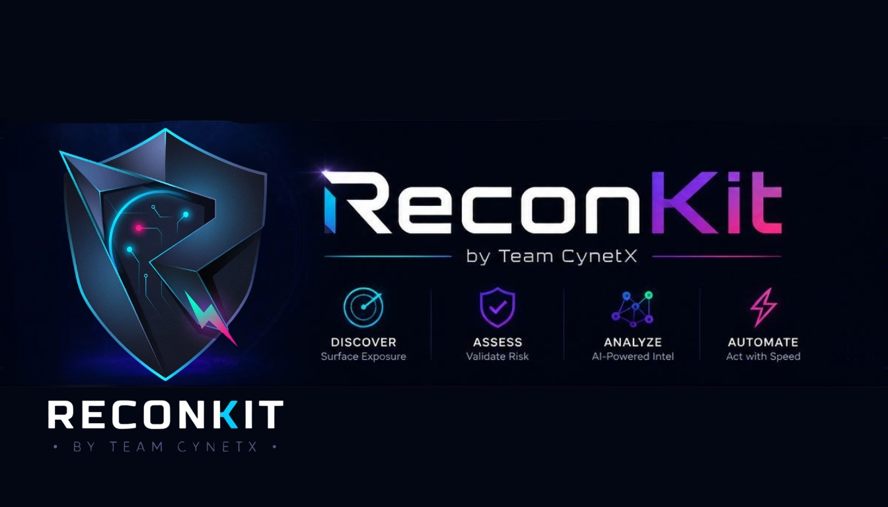

<div dir="rtl">

# ‏راهنمای فارسی ReconKit ⚡

<p align="center">
  
</p>

<p align="center">
  <b dir="rtl">ReconKit یک ابزار تمیز و کاربردی برای جمع‌آوری اطلاعات، اسکن سطح حمله، ساخت گزارش و تحلیل AI است.</b>
</p>

<p align="center">
  <a href="https://cynetx.ir">وب‌سایت Team CynetX</a> •
  <a href="https://t.me/cynetx">تلگرام Team CynetX</a>
</p>

---

## ‏راهنما و ویدیوی معرفی

<p align="center" dir="rtl">
  <a href="README_FA.md"><b>🇮🇷 مستندات فارسی</b></a>
  &nbsp;•&nbsp;
  <a href="README.md"><b>🇬🇧 English Documentation</b></a>
</p>

<p align="center">
  <a href="https://youtu.be/SHGSs4-qw9Y">
    
  </a>
</p>

<p align="center">
  <a href="https://youtu.be/SHGSs4-qw9Y"></a>
</p>

> ‏راهنمای فارسی یا انگلیسی را انتخاب کن، بعد اگر خواستی قبل از نصب حس واقعی ابزار را ببینی، ویدیوی یوتیوب را ببین؛ داخل ویدیو ReconKit را معرفی کردیم، اجرا کردیم و خروجی واقعی اسکن و گزارش را نشان دادیم.

---

## ‏فهرست سریع

- ‏[راهنما و ویدیوی معرفی](#راهنما-و-ویدیوی-معرفی)
- ‏[ReconKit چیست؟](#reconkit-چیست)
- ‏[ویژگی‌های مهم](#ویژگیهای-مهم)
- ‏[پیش‌نمایش](#پیشنمایش)
- ‏[نصب سریع](#نصب-سریع)
- ‏[شروع سریع](#شروع-سریع)
- ‏[کنسول تعاملی](#کنسول-تعاملی)
- ‏[حالت‌های اسکن](#حالتهای-اسکن)
- ‏[ماژول‌ها](#ماژولها)
- ‏[Scan Presetها](#scan-presetها)
- ‏[ساخت Preset سفارشی](#ساخت-preset-سفارشی)
- ‏[گزارش‌ها و خروجی‌ها](#گزارشها-و-خروجیها)
- ‏[هوش مصنوعی OpenRouter](#هوش-مصنوعی-openrouter)
- ‏[نصب ابزارهای جانبی](#نصب-ابزارهای-جانبی)
- ‏[حذف ReconKit](#حذف-reconkit)
- ‏[تمام سوییچ‌ها و آپشن‌ها](#تمام-سوییچها-و-آپشنها)
- ‏[رفع خطاهای رایج](#رفع-خطاهای-رایج)
- ‏[نکات اخلاقی و قانونی](#نکات-اخلاقی-و-قانونی)

---

## ‏ReconKit چیست؟

‏ReconKit یک ابزار خط فرمان برای **Recon / شناسایی امنیتی مجاز** است. به جای اینکه برای هر هدف چندین ابزار جداگانه را دستی اجرا کنی، ReconKit این کارها را مرتب و قابل فهم انجام می‌دهد:

- ‏جمع‌آوری DNS و رکوردهای مهم دامنه
- ‏اسکن پورت با `nmap`
- ‏گرفتن خلاصه WHOIS
- ‏fingerprint وب با `whatweb` و `httpx`
- ‏بررسی TLS با `sslscan` یا `testssl.sh`
- ‏بررسی WAF با `wafw00f`
- ‏کشف passive subdomain با `subfinder` و `amass`
- ‏crawl ساده با `katana`
- ‏screenshot با `gowitness`
- ‏template check با `nuclei`
- ‏خروجی JSON / Markdown / HTML / raw artifacts
- ‏تحلیل AI با OpenRouter
- ‏ساخت preset اختصاصی برای اسکن‌های تکراری

> ‏نکته مهم: ReconKit برای سیستم‌هایی است که مالک آن هستی یا مجوز کتبی برای تست داری. ابزار برای brute force، exploit، malware، persistence، bypass یا خرابکاری طراحی نشده است.

---

## ‏ویژگی‌های مهم

- ‏**کنسول تعاملی ساده**: با `reconkit` وارد محیطی شبیه launcher می‌شوی و با دستورهایی مثل `set target`, `show options`, `run`, `mission` کار می‌کنی.
- ‏**ترکیب ابزارهای واقعی recon**: DNS، nmap، WHOIS، fingerprint وب، TLS، passive discovery، screenshot و nuclei template checks در یک workflow مرتب جمع شده‌اند.
- ‏**تحلیل AI**: خروجی scan را به OpenRouter می‌فرستد و یک تحلیل دفاعی خوانا و مرحله‌بندی‌شده می‌دهد.
- ‏**گزارش‌های قابل ارائه**: خروجی JSON، Markdown، HTML، raw artifacts، diff و AI report دارد.
- ‏**نصب خودکار ابزارها**: روی Linux/macOS تلاش می‌کند ابزارهای لازم را با package manager، Go، pipx یا pip نصب کند.
- ‏**خروجی تمیز و قابل فهم**: جدول‌ها، خلاصه‌ها، notes و commandهای اجراشده را مرتب نشان می‌دهد.

---

## ‏پیش‌نمایش

<p align="center">
  
</p>

‏ReconKit خروجی اسکن را به شکل منظم نشان می‌دهد: خلاصه هدف، DNS، پورت‌ها، سرویس‌ها، ابزارهای جانبی، notes، گزارش‌ها و تحلیل AI در یک نمای خوانا کنار هم قرار می‌گیرند.

---

## ‏نصب سریع

### ‏نصب کامل روی Linux / macOS

‏ساده‌ترین روش نصب:

```bash
curl -fsSL https://raw.githubusercontent.com/icynetx/RconKIT/main/scripts/install.sh | sh
```

‏این دستور تلاش می‌کند:

- ‏سورس ReconKit را دریافت کند
- ‏دستور `reconkit` را نصب کند
- ‏ابزارهای لازم و اختیاری را نصب کند
- ‏مسیرهای لازم مثل `~/.local/bin` و Go bin را تا جای ممکن آماده کند
- ‏در پایان وضعیت ابزارها را نشان بدهد

‏بعد از نصب، یک ترمینال جدید باز کن و بزن:

```bash
reconkit
```

‏یا:

```bash
reconkit --check-deps
```

### ‏نصب فقط خود ReconKit بدون ابزارهای جانبی

‏اگر می‌خواهی فقط دستور `reconkit` نصب شود و فعلاً ابزارهای اسکن نصب نشوند:

```bash
curl -fsSL https://raw.githubusercontent.com/icynetx/RconKIT/main/scripts/install.sh | RECONKIT_SKIP_TOOLS=1 sh
```

### ‏نصب فقط ابزارهای ضروری

```bash
curl -fsSL https://raw.githubusercontent.com/icynetx/RconKIT/main/scripts/install.sh | RECONKIT_INSTALL_OPTIONAL=0 sh
```

### ‏اگر GitHub clone کند بود

‏گاهی روی بعضی اینترنت‌ها `git clone` خیلی کند می‌شود. این حالت باعث می‌شود installer سریع‌تر از clone رد شود و روش ZIP را امتحان کند:

```bash
curl -fsSL https://raw.githubusercontent.com/icynetx/RconKIT/main/scripts/install.sh | RECONKIT_GIT_TIMEOUT=10 sh
```

### ‏نصب دستی از سورس

‏اگر repo را دانلود یا clone کرده‌ای:

```bash
cd RconKIT
python3 recon.py --self-install --user
reconkit --install-deps --with-optional
reconkit --check-deps
```

‏برای اجرای مستقیم بدون نصب command:

```bash
python3 recon.py --help
python3 recon.py example.com
```

### ‏سیستم‌های پشتیبانی‌شده

| ‏سیستم | ‏روش پیشنهادی نصب |
|---|---|
| ‏Kali / Ubuntu / Debian | ‏`curl -fsSL .../scripts/install.sh | sh` |
| ‏Fedora / RHEL-like | ‏`curl -fsSL .../scripts/install.sh | sh` |
| ‏Arch Linux | ‏`curl -fsSL .../scripts/install.sh | sh` |
| ‏Alpine Linux | ‏`curl -fsSL .../scripts/install.sh | sh` |
| ‏macOS | ‏`curl -fsSL .../scripts/install.sh | sh` |

‏برای اولین تست جدی، یک VPS یا VM تمیز بهترین گزینه است تا نصب خودکار ابزارها از صفر تا صد بهتر بررسی شود.

---

## ‏شروع سریع

### ‏اجرای ساده

```bash
reconkit example.com
```

‏این دستور یک اسکن سریع و خوانا اجرا می‌کند.

### ‏اسکن عمیق‌تر

```bash
reconkit example.com --deep
```

‏یا:

```bash
reconkit example.com -m deep
```

### ‏اسکن کامل‌تر با گزارش

```bash
reconkit example.com --mission --raw-dir artifacts -o scan.json --markdown report.md --html report.html
```

‏خروجی‌ها:

- ‏`scan.json`: داده ساختاریافته برای پردازش بعدی
- ‏`report.md`: گزارش Markdown مناسب GitHub یا مستندسازی
- ‏`report.html`: گزارش HTML مستقل
- ‏`artifacts/`: خروجی خام ابزارها

### ‏نمایش دستورهای واقعی ابزارها

```bash
reconkit example.com --cmd
```

‏این گزینه برای debug و یادگیری عالی است، چون می‌بینی ReconKit دقیقاً چه دستورهایی اجرا کرده است.

---

## ‏کنسول تعاملی

‏اگر فقط بزنی:

```bash
reconkit
```

‏ReconKit مثل یک کنسول تعاملی باز می‌شود. این حالت برای کاربر تازه‌کار خیلی راحت‌تر است.

‏نمونه کار:

```text
reconkit(no-target)> help
reconkit(no-target)> set target example.com
reconkit(example.com)> set mode balanced
reconkit(example.com)> set modules mission
reconkit(example.com)> enable show_commands
reconkit(example.com)> run
reconkit(example.com)> exit
```

### ‏دستورهای کنسول

| ‏دستور | ‏توضیح |
|---|---|
| ‏`help` یا `?` | ‏نمایش راهنمای کنسول |
| ‏`version` | ‏نمایش نسخه ReconKit و لینک‌های Team CynetX |
| ‏`show options` | ‏نمایش تنظیمات فعلی اسکن |
| ‏`show modules` | ‏نمایش presetهای ماژول‌ها |
| ‏`show deps` یا `show tools` | ‏نمایش وضعیت نصب ابزارها |
| ‏`show ai` | ‏نمایش تنظیمات AI بدون لو دادن کامل API key |
| ‏`set target example.com` | ‏تنظیم تارگت |
| ‏`set mode fast` | ‏تنظیم حالت اسکن: `fast`, `balanced`, `deep` |
| ‏`set modules mission` | ‏تنظیم ماژول‌ها |
| ‏`set ports 80,443,8080` | ‏تنظیم پورت‌های دلخواه |
| ‏`unset ports` | ‏حذف پورت‌های دستی و برگشت به پیش‌فرض |
| ‏`set timeout 120` | ‏تنظیم timeout هر ابزار بر حسب ثانیه |
| ‏`set raw_dir artifacts` | ‏تنظیم مسیر ذخیره خروجی خام |
| ‏`set json scan.json` | ‏تنظیم خروجی JSON |
| ‏`set markdown report.md` | ‏تنظیم خروجی Markdown |
| ‏`set html report.html` | ‏تنظیم خروجی HTML |
| ‏`set extra --scan-preset mypreset --cmd` | ‏اضافه کردن آپشن‌های پیشرفته به اجرای بعدی |
| ‏`enable ai` | ‏فعال کردن تحلیل AI |
| ‏`disable ai` | ‏غیرفعال کردن تحلیل AI |
| ‏`enable aggressive` | ‏فعال کردن چک‌های سنگین‌تر مجاز |
| ‏`disable aggressive` | ‏غیرفعال کردن aggressive |
| ‏`enable no_whois` | ‏رد کردن WHOIS |
| ‏`enable show_commands` | ‏نمایش دستورهای اجراشده |
| ‏`run` یا `scan` | ‏اجرای اسکن با تنظیمات فعلی |
| ‏`quick example.com` | ‏اسکن سریع همان لحظه |
| ‏`mission example.com` | ‏اجرای workflow کامل mission |
| ‏`install` | ‏نصب ابزارهای required + optional |
| ‏`uninstall` | ‏حذف command نصب‌شده `reconkit` |
| ‏`uninstall purge` | ‏حذف command به همراه config/presetها و پوشه نصب محلی وقتی امن باشد |
| ‏`dryrun` | ‏نمایش برنامه نصب بدون نصب واقعی |
| ‏`test ai` | ‏تست endpoint/model/API key هوش مصنوعی |
| ‏`ai init` | ‏ساخت یا آپدیت فایل کانفیگ AI |
| ‏`ai show` | ‏نمایش کانفیگ AI |
| ‏`ai prompt` | ‏نمایش system prompt فعلی |
| ‏`ai set model openrouter/free` | ‏تنظیم model از داخل کنسول |
| ‏`ai set-file system_prompt prompt.txt` | ‏تنظیم prompt از فایل |
| ‏`shell <command>` | ‏اجرای یک دستور محلی shell |
| ‏`clear` | ‏پاک کردن صفحه |
| ‏`exit`, `quit`, `q` | ‏خروج از کنسول |

---

## ‏حالت‌های اسکن

‏ReconKit سه mode اصلی دارد:

| ‏Mode | ‏دستور نمونه | ‏مناسب برای |
|---|---|---|
| ‏`fast` | ‏`reconkit example.com` | ‏شروع سریع، پورت‌های رایج، خروجی سریع |
| ‏`balanced` | ‏`reconkit example.com -m balanced` | ‏بررسی متعادل‌تر با پوشش بیشتر |
| ‏`deep` | ‏`reconkit example.com -m deep` | ‏بررسی عمیق‌تر با service/version/default scripts در nmap |

### ‏مثال‌ها

```bash
reconkit example.com -m fast
reconkit example.com -m balanced
reconkit example.com -m deep
reconkit example.com --deep
```

---

## ‏ماژول‌ها

‏با `-M` یا `--modules` مشخص می‌کنی ReconKit علاوه بر DNS و nmap چه بخش‌هایی را اجرا کند.

| ‏Module | ‏توضیح |
|---|---|
| ‏`none` | ‏فقط core DNS + nmap |
| ‏`dns` یا `dns-tools` | ‏اجرای `host` و `nslookup` |
| ‏`dns-deep` | ‏بررسی AXFR با `dig axfr` |
| ‏`passive` یا `subdomains` | ‏کشف passive subdomain با `subfinder` و `amass` |
| ‏`web` | ‏fingerprint وب با `whatweb`, `httpx`, `wafw00f` |
| ‏`http` | ‏web + header check و crawl ساده |
| ‏`http-detail` | ‏بررسی header با `curl` و crawl با `katana` |
| ‏`tls` یا `ssl` | ‏بررسی TLS با `sslscan` یا `testssl.sh` |
| ‏`screenshots` یا `shots` | ‏screenshot با `gowitness` |
| ‏`templates` یا `nuclei` | ‏اجرای template checks با `nuclei` |
| ‏`safe` | ‏پیش‌فرض: `dns-tools`, `web`, `tls` |
| ‏`all` | ‏safe + passive + dns-deep + http-detail |
| ‏`full` | ‏all + screenshots + templates |
| ‏`mission` | ‏مثل full، مناسب workflow کامل |

### ‏مثال‌ها

```bash
reconkit example.com -M none
reconkit example.com -M safe
reconkit example.com -M web,tls
reconkit example.com -M passive,dns-deep
reconkit example.com -M web,http-detail,screenshots
reconkit example.com --mission
```

### ‏فعال کردن moduleها با سوییچ جدا

```bash
reconkit example.com --passive
reconkit example.com --http-detail
reconkit example.com --screenshots
reconkit example.com --templates
```

---

## ‏Scan Presetها

‏Presetها برای این هستند که بدون حفظ کردن ده‌ها تنظیم، یک سبک اسکن آماده انتخاب کنی.

| ‏Preset | ‏کاربرد |
|---|---|
| ‏`quick` | ‏سریع‌ترین حالت برای نگاه اولیه |
| ‏`standard` | ‏حالت پیش‌فرض و متعادل |
| ‏`full` | ‏اسکن طولانی‌تر و کامل‌تر |
| ‏`web` | ‏تمرکز بیشتر روی وب |
| ‏`vuln` | ‏مناسب template check با nuclei و بررسی محافظه‌کارانه‌تر |

### ‏مثال‌ها

```bash
reconkit example.com --scan-preset quick
reconkit example.com --scan-preset standard
reconkit example.com --mission --scan-preset full
reconkit example.com -M web,http-detail --scan-preset web
reconkit example.com --templates --scan-preset vuln
```

### ‏دیدن presetها

```bash
reconkit --preset-list
```

### ‏دیدن جزئیات یک preset

```bash
reconkit --preset-show full
reconkit --preset-show mypreset
```

---

## ‏ساخت Preset سفارشی

‏این بخش یکی از مهم‌ترین قابلیت‌های ReconKit است. تو می‌توانی یک preset با اسم دلخواه بسازی، برای هر ابزار args مخصوص بدهی، بعد همیشه فقط با همان اسم اجرا کنی.

### ‏روش ۱: Wizard تعاملی و ساده

```bash
reconkit --preset-create
```

‏ابزار از تو می‌پرسد:

‏1. اسم preset
‏2. base preset مثل `standard` یا `full`
‏3. mode یا strategy
‏4. توضیح اختیاری
‏5. args ابزارها یکی‌یکی: `nmap`, `dig`, `host`, `httpx`, `nuclei`, ...

‏اگر برای ابزاری چیزی نمی‌خواهی، فقط Enter بزن.

‏نمونه ذهنی:

```text
Preset name: myweb
Base preset quick/standard/full/web/vuln [standard]: full
Mode append/replace/only [append]: only
Description (optional): اسکن وب سفارشی من
nmap args: -sV -Pn -p 80,443 -oN - {target}
dig args:
host args:
...
httpx args: -silent -title -status-code -u {url}
nuclei args: -silent -tags cves -u {url}
```

‏بعد استفاده:

```bash
reconkit example.com --scan-preset myweb --cmd
```

### ‏روش ۲: اسم را از اول بده

```bash
reconkit --preset-create corpfull
```

‏در این حالت اسم از قبل مشخص است و بقیه موارد را wizard می‌پرسد.

### ‏روش ۳: ساخت کامل با یک دستور

```bash
reconkit --preset-create corpfull --preset-base full --preset-strategy append --preset-desc "Corp full scan" \
  --preset-add 'nmap=--reason' \
  --preset-add 'httpx=-H "X-ROE-ID: ACME-2026"' \
  --preset-add 'nuclei=-tags cves'
```

### ‏Preset Strategyها

| ‏Strategy | ‏معنی | ‏چه زمانی استفاده شود؟ |
|---|---|---|
| ‏`append` | ‏args تو به دستورهای پیش‌فرض ReconKit اضافه می‌شود | ‏وقتی فقط چند گزینه اضافه می‌خواهی |
| ‏`replace` | ‏برای ابزارهایی که تنظیم کرده‌ای، دستور پیش‌فرض همان ابزار جایگزین می‌شود | ‏وقتی می‌خواهی سبک اجرای یک ابزار را خودت تعیین کنی |
| ‏`only` | ‏فقط ابزارهایی اجرا می‌شوند که در preset برایشان args داده‌ای | ‏وقتی می‌خواهی preset کاملاً کنترل کند چه چیزی اجرا شود |

### ‏مثال append

```bash
reconkit --preset-create addheaders --preset-strategy append \
  --preset-add 'nmap=--reason' \
  --preset-add 'httpx=-H "X-Client: ACME"' \
  --preset-add 'nuclei=-tags exposure'

reconkit example.com --mission --scan-preset addheaders
```

‏نکته: `--reason` در این مثال سوییچ خود ReconKit نیست؛ یک آرگومان nmap است که داخل preset به nmap پاس داده می‌شود.

### ‏مثال replace

```bash
reconkit --preset-create mynmap --preset-strategy replace \
  --preset-add 'nmap=-sV -Pn -p 1-1000 -oN - {target}'

reconkit example.com --scan-preset mynmap --cmd
```

‏در این حالت nmap با args خودت اجرا می‌شود، اما بخش‌های دیگر ReconKit طبق workflow معمول می‌توانند اجرا شوند.

### ‏مثال only

```bash
reconkit --preset-create onlyweb --preset-strategy only \
  --preset-add 'nmap=-sV -Pn -p 80,443 -oN - {target}' \
  --preset-add 'httpx=-silent -title -status-code -u {url}'

reconkit example.com --scan-preset onlyweb --cmd
```

‏در حالت `only` ابزارهایی که داخل preset تعریف نشده‌اند skip می‌شوند.

### ‏Placeholderها در preset

| ‏Placeholder | ‏جایگزین می‌شود با |
|---|---|
| ‏`{target}` | ‏تارگت نرمال‌شده، مثل `example.com` یا IP |
| ‏`{domain}` | ‏مقدار دامنه/تارگت |
| ‏`{url}` | ‏اولین URL وب تشخیص‌داده‌شده، مثل `https://example.com` |
| ‏`{out_dir}` | ‏مسیر artifact برای ابزارهایی مثل `gowitness` |

### ‏مدیریت presetها

```bash
reconkit --preset-list
reconkit --preset-show myweb
reconkit --preset-delete myweb
```

### ‏ابزارهایی که در preset پشتیبانی می‌شوند

```text
nmap, dig, host, nslookup, whois, whatweb, httpx, wafw00f, nikto,
sslscan, testssl.sh, subfinder, amass, curl, katana, gowitness, nuclei
```

---

## ‏گزارش‌ها و خروجی‌ها

‏ReconKit می‌تواند خروجی را چند شکل ذخیره کند.

| ‏خروجی | ‏سوییچ | ‏توضیح |
|---|---|---|
| ‏JSON | ‏`-o scan.json` یا `--json scan.json` | ‏داده ساختاریافته برای پردازش یا diff |
| ‏Markdown | ‏`--markdown report.md` یا `--md report.md` | ‏گزارش قابل خواندن در GitHub |
| ‏HTML | ‏`--html report.html` | ‏گزارش HTML مستقل |
| ‏Raw artifacts | ‏`--raw-dir artifacts` | ‏خروجی خام ابزارها |
| ‏Diff | ‏`--diff old.json` | ‏مقایسه اسکن جدید با JSON قبلی |
| ‏AI report | ‏`--ai-out ai-report.md` | ‏ذخیره تحلیل AI |

### ‏مثال گزارش کامل

```bash
reconkit example.com --mission --raw-dir artifacts -o scan.json --markdown report.md --html report.html
```

### ‏مقایسه دو اسکن

‏اول اسکن قبلی:

```bash
reconkit example.com -o old.json
```

‏بعداً:

```bash
reconkit example.com --diff old.json -o new.json
```

---

## ‏هوش مصنوعی OpenRouter

‏ReconKit می‌تواند نتیجه اسکن را به AI بدهد و یک تحلیل انگلیسی و خوانا بسازد؛ شامل خلاصه، ریسک‌ها، سطح حمله، پیشنهاد تست‌های بعدی و راهکار دفاعی.

### ‏ساخت کانفیگ AI

```bash
reconkit --ai-init
```

‏این دستور فایل `recon_config.json` را می‌سازد یا آپدیت می‌کند.

### ‏دیدن کانفیگ AI

```bash
reconkit --ai-show
```

‏یا:

```bash
reconkit --show-config
```

### ‏تنظیم مدل و endpoint

```bash
reconkit --ai-set endpoint_url=https://openrouter.ai/api/v1/chat/completions
reconkit --ai-set model=openrouter/free
```

### ‏تنظیم API key با Environment Variable

‏پیشنهادی‌ترین حالت این است که key را داخل env بگذاری:

```bash
reconkit --ai-set api_key_env=OPENROUTER_API_KEY
export OPENROUTER_API_KEY="YOUR_OPENROUTER_API_KEY"
```

‏بعد تست کن:

```bash
reconkit --test-ai
```

### ‏ذخیره مستقیم API key در config

‏این روش کار می‌کند، ولی مراقب باش فایل config را داخل GitHub push نکنی:

```bash
reconkit --ai-set api_key=YOUR_OPENROUTER_API_KEY
```

### ‏تنظیم system prompt از فایل

‏اگر یک prompt طولانی داری:

```bash
reconkit --ai-set-file system_prompt=prompt.txt
```

‏نمایش prompt فعلی:

```bash
reconkit --ai-prompt
```

### ‏تنظیمات خروجی AI

```bash
reconkit --ai-set temperature=0.15
reconkit --ai-set max_tokens=5000
reconkit --ai-set continuation_rounds=5
reconkit --ai-set empty_response_retries=5
```

### ‏اجرای اسکن با AI

```bash
reconkit example.com --deep --ai --ai-out ai-report.md -o scan.json
```

### ‏کلیدهای مهم config AI

| ‏Key | ‏توضیح | ‏مثال |
|---|---|---|
| ‏`endpoint_url` | ‏endpoint سازگار با OpenRouter chat completions | ‏`https://openrouter.ai/api/v1/chat/completions` |
| ‏`model` | ‏نام مدل یا router | ‏`openrouter/free` |
| ‏`api_key_env` | ‏نام env برای API key | ‏`OPENROUTER_API_KEY` |
| ‏`api_key` | ‏API key مستقیم داخل config | ‏`sk-or-...` |
| ‏`system_prompt` | ‏دستورالعمل اصلی AI | ‏از فایل با `--ai-set-file` |
| ‏`temperature` | ‏میزان تنوع خروجی | ‏`0.15` |
| ‏`max_tokens` | ‏سقف طول پاسخ | ‏`5000` |
| ‏`continuation_rounds` | ‏ادامه دادن اگر خروجی ناقص شد | ‏`5` |
| ‏`empty_response_retries` | ‏تلاش دوباره وقتی مدل رایگان پاسخ خالی داد | ‏`5` |
| ‏`http_referer` | ‏header مخصوص OpenRouter | ‏`https://local.reconkit` |
| ‏`x_title` | ‏عنوان درخواست OpenRouter | ‏`ReconKit AI Analysis` |

---

## ‏نصب ابزارهای جانبی

### ‏بررسی وضعیت ابزارها

```bash
reconkit --check-deps
```

### ‏نصب ابزارهای ضروری

```bash
reconkit --install-deps
```

### ‏نصب ابزارهای ضروری + اختیاری

```bash
reconkit --install-deps --with-optional
```

### ‏فقط دیدن برنامه نصب بدون اجرا

```bash
reconkit --install-deps --with-optional --dry-run
```

### ‏ابزارهایی که ReconKit می‌تواند استفاده کند

| ‏دسته | ‏ابزارها |
|---|---|
| ‏Core | ‏`nmap`, `dig`, `host`, `nslookup`, `whois` |
| ‏Web | ‏`whatweb`, `httpx` / `httpx-toolkit`, `curl` |
| ‏WAF/TLS | ‏`wafw00f`, `sslscan`, `testssl.sh` |
| ‏Passive Discovery | ‏`subfinder`, `amass` |
| ‏Crawl/Screenshot | ‏`katana`, `gowitness` |
| ‏Template Checks | ‏`nuclei` |
| ‏Helper | ‏`jq` |

> ‏اگر بعضی ابزارهای optional روی سیستم نصب نشدند، ReconKit نمی‌شکند. فقط همان بخش را skip می‌کند و در Notes توضیح می‌دهد.

---


## ‏حذف ReconKit

اگر خواستی فقط دستور نصب‌شده `reconkit` حذف شود:

```bash
reconkit --uninstall
```

برای اینکه قبل از حذف ببینی چه چیزهایی حذف می‌شوند:

```bash
reconkit --uninstall --dry-run
```

اگر می‌خواهی command به همراه فایل‌های config/preset و پوشه نصب `~/.reconkit` هم حذف شود، از purge استفاده کن:

```bash
reconkit --uninstall --purge
```

از داخل منوی تعاملی هم می‌توانی بزنی:

```text
reconkit(no-target)> uninstall
reconkit(no-target)> uninstall purge
```

نکته مهم: حذف ReconKit ابزارهای مشترک سیستم مثل `nmap`, `curl`, `go`, `python3` یا ابزارهای نصب‌شده با package manager را حذف نمی‌کند، چون ممکن است برنامه‌های دیگر هم از آن‌ها استفاده کنند.

---

## ‏تمام سوییچ‌ها و آپشن‌ها

‏این جدول بر اساس سوییچ‌های واقعی ابزار نوشته شده است.

| ‏سوییچ | ‏مثال | ‏توضیح |
|---|---|---|
| ‏`target` | ‏`reconkit example.com` | ‏دامنه، IP یا URL هدف |
| ‏`-h`, `--help` | ‏`reconkit --help` | ‏نمایش راهنما |
| ‏`-m`, `--mode`, `--profile` | ‏`-m balanced` | ‏انتخاب mode: `fast`, `balanced`, `deep` |
| ‏`-p`, `--ports` | ‏`-p 80,443,8080` | ‏تعیین پورت یا رنج پورت برای nmap |
| ‏`-M`, `--modules` | ‏`-M web,tls` | ‏انتخاب ماژول‌ها |
| ‏`-A`, `--aggressive` | ‏`-A` | ‏فعال کردن چک‌های سنگین‌تر مجاز مثل `nikto`/`testssl.sh` وقتی نصب باشند |
| ‏`-t`, `--timeout` | ‏`-t 120` | ‏timeout هر دستور ابزار بر حسب ثانیه |
| ‏`-o`, `--json` | ‏`-o scan.json` | ‏ذخیره گزارش JSON |
| ‏`--markdown`, `--md` | ‏`--markdown report.md` | ‏ذخیره گزارش Markdown |
| ‏`--html` | ‏`--html report.html` | ‏ذخیره گزارش HTML |
| ‏`--raw-dir` | ‏`--raw-dir artifacts` | ‏ذخیره خروجی خام ابزارها |
| ‏`--diff` | ‏`--diff old.json` | ‏مقایسه با گزارش JSON قبلی |
| ‏`--deep` | ‏`--deep` | ‏alias برای `-m deep` |
| ‏`--mission` | ‏`--mission` | ‏فعال کردن workflow کامل mission |
| ‏`--passive` | ‏`--passive` | ‏اضافه کردن passive discovery |
| ‏`--http-detail` | ‏`--http-detail` | ‏اضافه کردن header check و crawl ساده |
| ‏`--screenshots` | ‏`--screenshots` | ‏گرفتن screenshot با `gowitness` |
| ‏`--templates`, `--nuclei` | ‏`--templates` | ‏اجرای template checks با `nuclei` |
| ‏`--scan-preset` | ‏`--scan-preset full` | ‏استفاده از preset داخلی یا سفارشی |
| ‏`--preset-list` | ‏`--preset-list` | ‏لیست presetها |
| ‏`--preset-show` | ‏`--preset-show mypreset` | ‏نمایش جزئیات preset |
| ‏`--preset-create` | ‏`--preset-create` | ‏ساخت preset با wizard |
| ‏`--preset-create NAME` | ‏`--preset-create mypreset` | ‏ساخت preset با اسم مشخص |
| ‏`--preset-base` | ‏`--preset-base full` | ‏base preset برای preset سفارشی |
| ‏`--preset-strategy` | ‏`--preset-strategy only` | ‏حالت preset: `append`, `replace`, `only` |
| ‏`--preset-add` | ‏`--preset-add 'nmap=--reason'` | ‏اضافه کردن args ابزار به preset؛ قابل تکرار |
| ‏`--preset-desc` | ‏`--preset-desc "Corp scan"` | ‏توضیح preset |
| ‏`--preset-delete` | ‏`--preset-delete mypreset` | ‏حذف preset سفارشی |
| ‏`--cmd`, `--show-commands` | ‏`--cmd` | ‏نمایش دستورهای واقعی اجراشده |
| ‏`--explain` | ‏`--explain` | ‏نمایش راهنمای سوییچ‌ها داخل خروجی اسکن |
| ‏`--no-color` | ‏`--no-color` | ‏غیرفعال کردن رنگ‌ها |
| ‏`--color` | ‏`--color` | ‏اجبار به نمایش رنگ‌ها |
| ‏`--no-whois` | ‏`--no-whois` | ‏رد کردن WHOIS |
| ‏`--install-deps` | ‏`--install-deps` | ‏نصب ابزارهای ضروری |
| ‏`--self-install`, `--setup` | ‏`--self-install --user` | ‏نصب دستور `reconkit` |
| ‏`--user` | ‏`--self-install --user` | ‏نصب در مسیر کاربر مثل `~/.local/bin` |
| ‏`--with-optional` | ‏`--install-deps --with-optional` | ‏نصب ابزارهای optional هم انجام شود |
| ‏`--dry-run` | ‏`--install-deps --dry-run` | ‏فقط نمایش برنامه نصب بدون اجرا |
| ‏`--check-deps` | ‏`--check-deps` | ‏بررسی وضعیت ابزارها |
| ‏`--uninstall` | ‏`--uninstall` | ‏حذف command نصب‌شده `reconkit` |
| ‏`--purge` | ‏`--uninstall --purge` | ‏همراه با uninstall، config/presetها و پوشه نصب محلی را هم حذف می‌کند وقتی امن باشد |
| ‏`--ai` | ‏`--ai` | ‏فعال کردن تحلیل AI بعد از اسکن |
| ‏`--ai-timeout` | ‏`--ai-timeout 90` | ‏timeout درخواست AI |
| ‏`--ai-out` | ‏`--ai-out ai-report.md` | ‏ذخیره خروجی AI |
| ‏`--ai-init` | ‏`--ai-init` | ‏ساخت/آپدیت کانفیگ AI |
| ‏`--ai-show` | ‏`--ai-show` | ‏نمایش امن کانفیگ AI |
| ‏`--ai-set` | ‏`--ai-set model=openrouter/free` | ‏تنظیم یک مقدار در config AI |
| ‏`--ai-set-file` | ‏`--ai-set-file system_prompt=prompt.txt` | ‏تنظیم مقدار config از فایل |
| ‏`--ai-prompt` | ‏`--ai-prompt` | ‏نمایش system prompt فعلی |
| ‏`--show-config` | ‏`--show-config` | ‏alias برای `--ai-show` |
| ‏`--test-ai` | ‏`--test-ai` | ‏تست endpoint/model/API key بدون اسکن |
| ‏`--version` | ‏`--version` | ‏نمایش نسخه و لینک‌های Team CynetX |

---

## ‏رفع خطاهای رایج

### ‏دستور `reconkit` پیدا نمی‌شود

‏یک ترمینال جدید باز کن. اگر هنوز مشکل بود:

```bash
echo $PATH
```

‏در نصب user معمولاً دستور در مسیر `~/.local/bin` قرار می‌گیرد.

### ‏بعضی ابزارها missing هستند

```bash
reconkit --install-deps --with-optional
reconkit --check-deps
```

‏اگر ابزار optional نصب نشود، معمولاً اسکن کامل متوقف نمی‌شود؛ فقط همان module خروجی کمتری می‌دهد.

### ‏خروجی رنگی در لاگ خراب دیده می‌شود

```bash
reconkit example.com --no-color
```

### ‏می‌خواهم دقیقاً بدانم چه دستورهایی اجرا شده

```bash
reconkit example.com --cmd
```

### ‏AI پاسخ خالی یا ناقص می‌دهد

```bash
reconkit --test-ai
reconkit --ai-set empty_response_retries=5
reconkit --ai-set continuation_rounds=5
```

‏اگر از مدل‌های رایگان OpenRouter استفاده می‌کنی، گاهی پاسخ خالی یا محدود طبیعی است. مدل پایدارتر انتخاب کن.

### ‏دامنه resolve نمی‌شود

‏اگر خروجی گفت IP پیدا نشد، احتمالاً دامنه اشتباه است، DNS مشکل دارد، یا رکورد A/AAAA ندارد. اول با این‌ها چک کن:

```bash
host example.com
dig example.com
```

---

## ‏نکات اخلاقی و قانونی

‏ReconKit برای کار حرفه‌ای و مجاز ساخته شده است:

- ‏اسکن دارایی‌های خودت
- ‏تست داخلی سازمان
- ‏bug bounty با scope مشخص
- ‏audit با مجوز کتبی
- ‏research در lab کنترل‌شده

‏از ابزار برای موارد زیر استفاده نکن:

- ‏اسکن غیرمجاز
- ‏brute force یا password spraying
- ‏exploit و خرابکاری
- ‏malware یا persistence
- ‏دور زدن دفاع‌ها یا مخفی‌کاری غیرمجاز

> ‏همیشه قبل از اسکن مطمئن شو scope و مجوز داری. خروجی ReconKit برای کمک به دفاع، مستندسازی و تصمیم‌گیری امنیتی است.

---

## ‏Team CynetX

‏ReconKit توسط **Team CynetX** ساخته شده است؛ برای اینکه recon تمیزتر، قابل فهم‌تر و قابل ارائه‌تر باشد.

- ‏وب‌سایت: https://cynetx.ir
- ‏تلگرام: https://t.me/cynetx

‏© 2026 Team CynetX. All rights reserved.

</div>
